# Manual do Usuário — SprintHub VoIP

Bem-vindo ao SprintHub VoIP. Este guia mostra, passo a passo, como utilizar o aplicativo para fazer ligações, consultar contatos e acompanhar seu histórico de chamadas.

---

## Sumário

1. [Download do aplicativo](#1-download-do-aplicativo)
2. [Instalação e avisos de segurança](#2-instalação-e-avisos-de-segurança)
3. [Login](#3-login)
4. [Menu principal](#4-menu-principal)
5. [Contatos](#5-contatos)
6. [Histórico de ligações](#6-histórico-de-ligações)
7. [Discador](#7-discador)
8. [Seleção do número de saída](#8-seleção-do-número-de-saída)
9. [Tela de chamada em andamento](#9-chamada-em-andamento)
10. [Teclado durante a chamada](#10-teclado-durante-a-chamada)

---

## 1. Download do aplicativo

O instalador do SprintHub VoIP fica disponível dentro do próprio SprintHub. Acesse:

**Configurações do sistema > VoIP > Aplicativo VoIP**

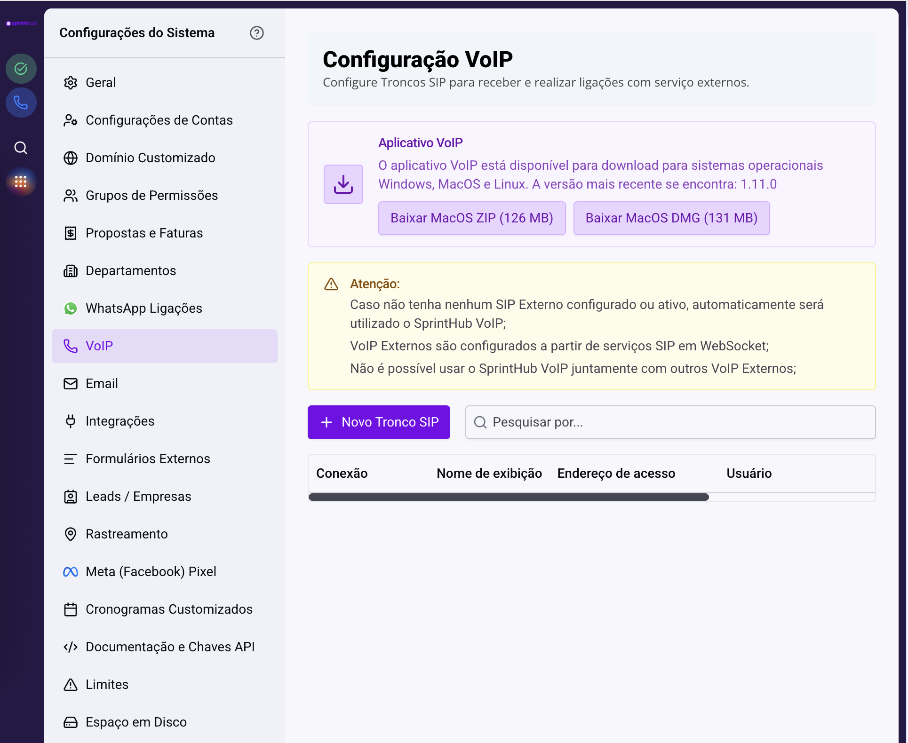

Nessa tela você encontra:

- A **versão mais recente** disponível para download.
- Os botões para baixar o instalador conforme o seu sistema operacional (Windows, macOS ou Linux).

Escolha o pacote correspondente ao seu sistema e aguarde a conclusão do download antes de prosseguir para a instalação.

> O aplicativo é compatível com **Windows, macOS e Linux**. Caso não veja a opção do seu sistema, fale com o administrador do SprintHub.

---

## 2. Instalação e avisos de segurança

Ao abrir o instalador pela primeira vez, o sistema operacional pode exibir um alerta informando que o programa é de um desenvolvedor desconhecido. Isso é esperado e **não significa que o aplicativo é inseguro** — apenas que ele ainda não passou pelo processo de assinatura completo do sistema. Siga as orientações abaixo para liberar a execução.

### Windows

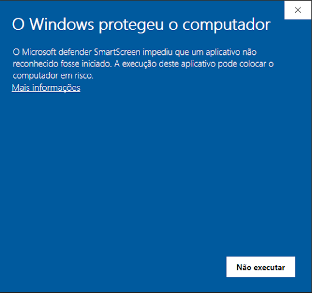

Quando o aviso **“O Windows protegeu o computador”** aparecer:

1. Clique em **Mais informações**.
2. Em seguida, clique em **Executar assim mesmo** para iniciar a instalação.

### macOS

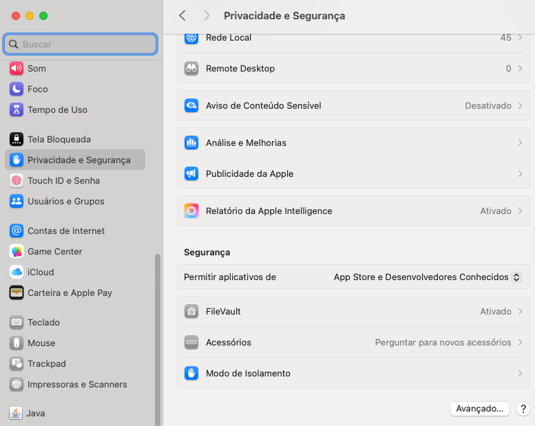

No macOS, abra **Configurações do Sistema > Privacidade e Segurança**:

1. Localize a seção **Segurança**.
2. Em **Permitir aplicativos de**, selecione **App Store e Desenvolvedores Conhecidos**.
3. Caso o aplicativo tenha sido bloqueado, role a tela e clique em **Abrir Mesmo Assim** ao lado da mensagem do SprintHub VoIP.

> Esses avisos só aparecem na primeira execução. Após autorizar, o aplicativo abre normalmente nas próximas vezes.

---

## 3. Login

A primeira tela é a de acesso. Informe os dados fornecidos pela sua empresa para entrar.

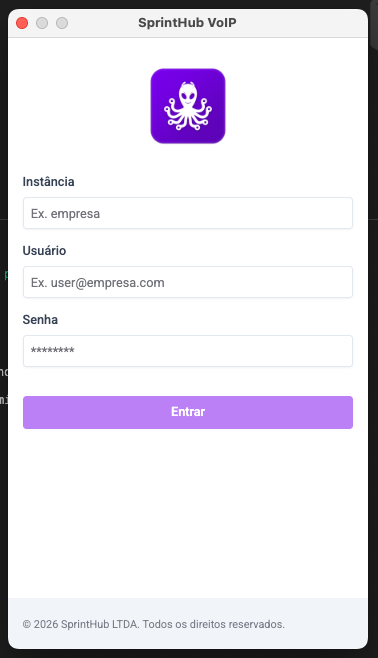

Campos obrigatórios:

- **Instância** — nome da sua empresa cadastrada no SprintHub (ex.: `empresa`).
- **Usuário** — seu e-mail corporativo (ex.: `user@empresa.com`).
- **Senha** — a mesma senha usada no SprintHub.

Clique em **Entrar** para acessar o aplicativo.

> Se não souber sua instância ou estiver com dificuldade para entrar, fale com o administrador do SprintHub na sua empresa.

---

## 4. Menu principal

Após o login, você cai no menu principal. É a partir daqui que você navega entre todas as funções do app.

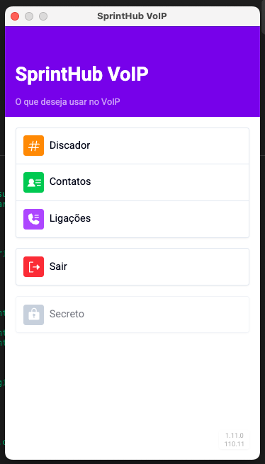

Opções disponíveis:

- **Discador** — abre o teclado para digitar o número e iniciar uma ligação.
- **Contatos** — lista todos os contatos da sua base, com busca rápida.
- **Ligações** — exibe o histórico completo de chamadas feitas e recebidas.
- **Sair** — encerra sua sessão e volta para a tela de login.

No canto inferior direito você vê a versão atual do aplicativo.

---

## 5. Contatos

Use esta tela para encontrar rapidamente quem você quer chamar.

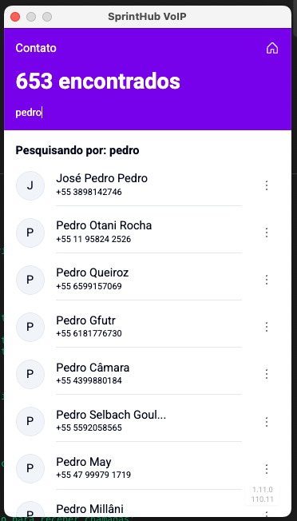

Como funciona:

- O contador no topo mostra **quantos contatos foram encontrados** com base na sua busca.
- Digite no campo de pesquisa para filtrar por nome. A lista é atualizada enquanto você digita.
- Cada contato exibe o **nome** e o **número de telefone**.
- Toque no menu de três pontos (à direita do contato) para ver opções adicionais.

Para voltar ao menu principal, use o ícone de **casa** no canto superior direito.

---

## 6. Histórico de ligações

Aqui você acompanha todas as chamadas registradas, com data, duração e número.

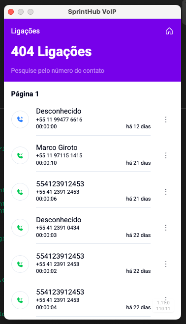

O que cada item mostra:

- **Nome do contato** (ou “Desconhecido”, quando o número não está cadastrado).
- **Número** discado ou recebido.
- **Duração** da chamada no formato `HH:MM:SS`.
- **Tempo decorrido** desde a ligação (ex.: “há 12 dias”).

O ícone à esquerda indica o tipo de chamada — atendida, perdida ou de saída. Use o campo de busca para filtrar pelo número do contato.

---

## 7. Discador

O discador é a forma mais direta de fazer uma ligação manual.

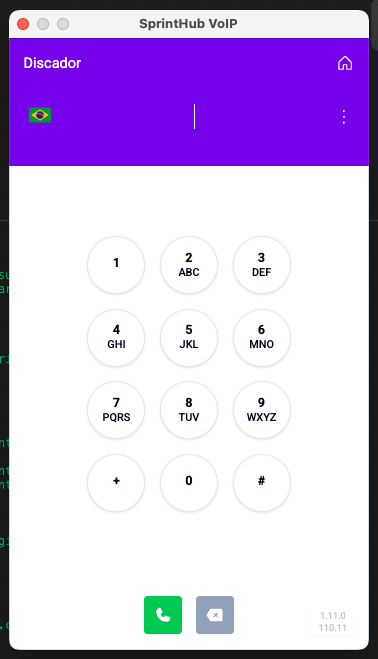

Como usar:

1. Digite o número desejado usando o teclado numérico.
2. O número aparece no topo da tela conforme você digita.
3. Toque no botão **verde com ícone de telefone** para iniciar a chamada.
4. Use o botão **cinza com X** para apagar o último dígito.

A bandeira no canto superior esquerdo identifica o país do número detectado.

---

## 8. Seleção do número de saída

Antes de completar a ligação, você escolhe **de qual número** a chamada será feita. Útil quando sua empresa tem múltiplas linhas.

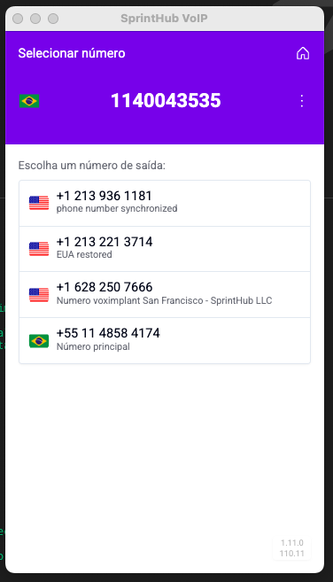

O que aparece nesta tela:

- No topo, o **número de destino** que você está prestes a discar.
- Logo abaixo, a lista de **números de saída disponíveis** para sua conta.
- Cada opção mostra a bandeira do país, o número e uma descrição (ex.: “Número principal”, “EUA restored”).

Toque no número que deseja usar como origem da chamada. A ligação começa automaticamente em seguida.

---

## 9. Chamada em andamento

Durante a ligação, esta é a tela principal. Ela mostra todas as informações da chamada ativa.

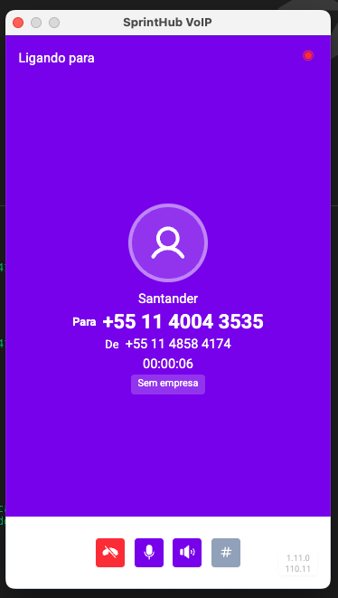

Informações exibidas:

- **Nome do contato** (quando identificado).
- **Para** — número que está sendo chamado.
- **De** — número de saída usado.
- **Tempo decorrido** da chamada.
- **Empresa associada**, quando houver.

Controles na barra inferior:

- **Botão vermelho** — encerra a chamada.
- **Microfone** — ativa ou desativa o mudo.
- **Alto-falante** — controla o volume / saída de áudio.
- **Tecla #** — abre o teclado numérico para enviar tons (DTMF), por exemplo em URAs.

---

## 10. Teclado durante a chamada

Esta tela aparece quando você toca no botão **#** durante uma ligação. É usada para navegar em menus automáticos (URAs), digitar ramais ou enviar códigos.

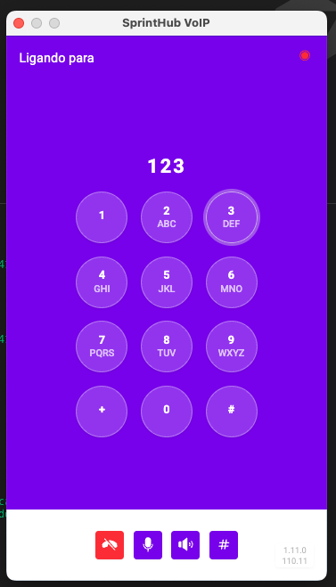

Como usar:

- Os dígitos pressionados aparecem no topo da tela.
- Cada toque envia o tom correspondente para a chamada em andamento.
- Os controles inferiores continuam funcionando: encerrar, mudo, áudio e fechar o teclado.

Para voltar à tela principal da chamada, toque novamente no botão **#**.

---

## Dicas rápidas

- Use o **discador** para números avulsos e os **contatos** para ligações recorrentes.
- Confirme sempre o **número de saída** antes de iniciar uma chamada importante — ele aparece para o destinatário.
- O **histórico** ajuda a retomar conversas: toque no contato para ver opções de retorno de ligação.
- O ícone de **casa** no topo das telas leva você direto ao menu principal a qualquer momento.

---

## Suporte

Em caso de dúvidas ou problemas técnicos, entre em contato com o suporte do SprintHub através dos canais oficiais da sua empresa.
